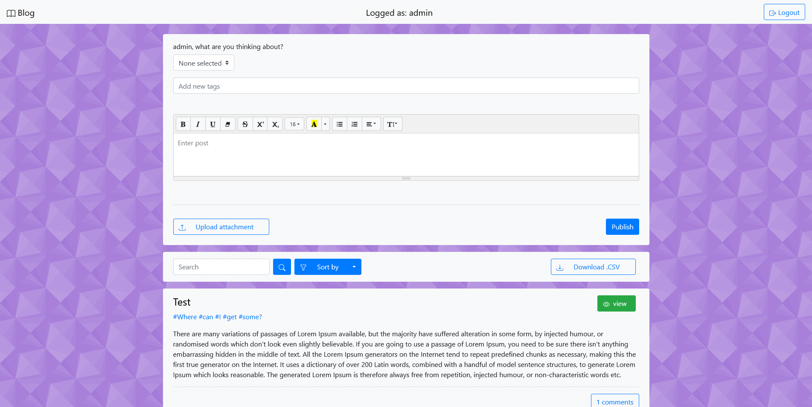
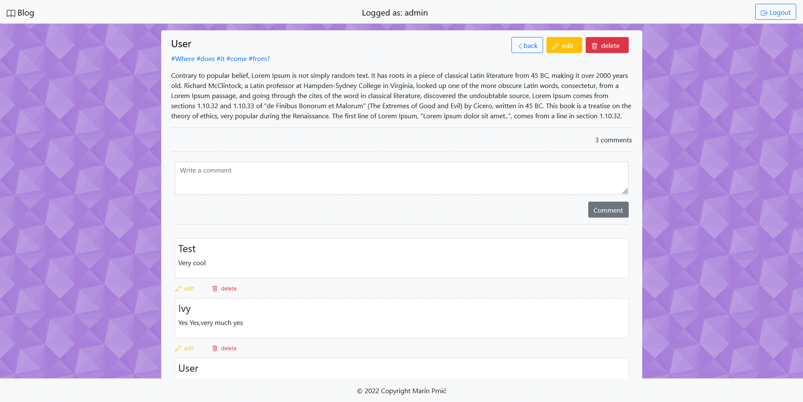
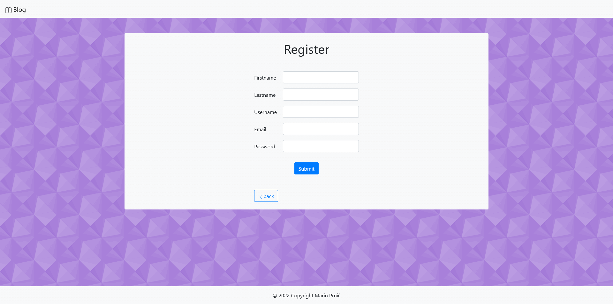
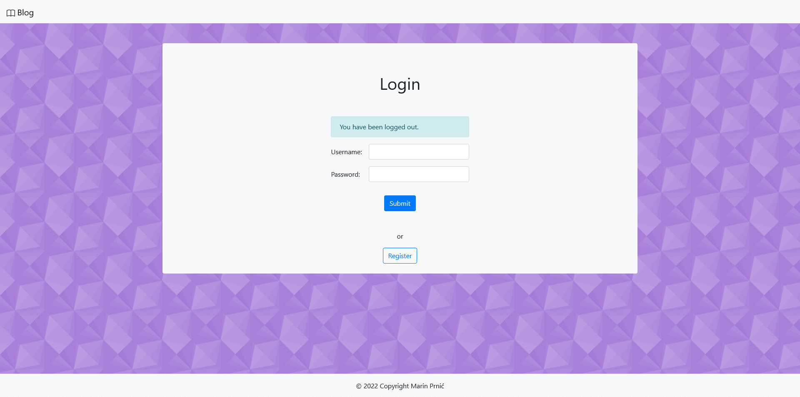
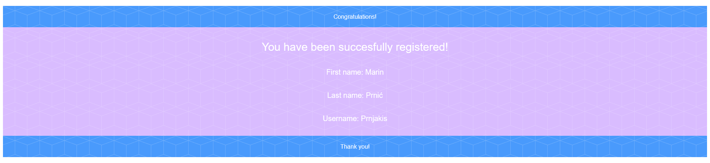

# BlogApp

## Table of Contents
* [Technologies](#technologies)
* [Features](#features)
* [Project structure](#project-structure)
* [Endpoints](#endpoints)
    * [API Endpoints](#api-endpoints)
    * [Web Endpoints](#web-endpoints)
* [Screenshots](#screenshots)
    * [Main window](#main-window)
    * [Posts](#posts)
    * [Register](#register)
    * [Generated email](#generated-email)


## Technologies
---
- Java
- Spring Boot 
- Sprin Mail
- Spring Security
- Spring Data
- Thymeleaf
- MySQL
- JPA / Hibernate
- Lombook
- Summernote
- Bootstrap
## Features
---
- add / edit / delete / comment posts
- login / register
- users with roles
- unregistered users can't access some content
- sorting / filtering posts
- database generated by beans from xml file, that was made procedurally from .csv files
- export database into .csv file
- attachment up to 128 MB can be stored on server
- REST API
## Project structure
``` 
main
├───java
│   └───com
│       └───example
│           └───blog
│               │   BlogApplication.java
│               │   
│               ├───config
│               │       SecurityConfiguration.java
│               │       
│               ├───controllers
│               │   ├───api
│               │   │       PostController.java
│               │   │       
│               │   └───web
│               │           AuthorController.java
│               │           BlogController.java
│               │           LoginController.java
│               │           PostController.java
│               │           RegisterController.java
│               │           
│               ├───model
│               │   │   Attachments.java
│               │   │   Authors.java
│               │   │   Comments.java
│               │   │   Posts.java
│               │   │   PostsAuthors.java
│               │   │   PostsAuthorsId.java
│               │   │   Roles.java
│               │   │   
│               │   └───validation
│               │           NotEmptyFields.java
│               │           NotEmptyFieldsValidator.java
│               │           
│               ├───repositories
│               │       AttachmentsRepository.java
│               │       AuthorsRepository.java
│               │       CommentsRepository.java
│               │       PostsAuthorsRepository.java
│               │       PostsRepository.java
│               │       RolesRepository.java
│               │       
│               ├───service
│               │   │   AttachmentsMemoryService.java
│               │   │   AuthorsMemoryService.java
│               │   │   CommentsMemoryService.java
│               │   │   PostsAuthorsMemoryService.java
│               │   │   PostsInMemoryService.java
│               │   │   
│               │   └───manager
│               │           AttachmentsManager.java
│               │           AuthorsManager.java
│               │           CommentsManager.java
│               │           PostsAuthorsManager.java
│               │           PostsManager.java
│               │           
│               └───storage
│                       FileSystemStorageService.java
│                       StorageException.java
│                       StorageFileNotFoundException.java
│                       StorageProperties.java
│                       StorageService.java
│                       
└───resources
    │   application.properties
    │   
    ├───static
    │       styles.css
    │       
    └───templates
            author.html
            edit-post.html
            email.html
            home.html
            login.html
            post-comment-edit.html
            post.html
            register.html
``` 

## Endpoints

### API Endpoints
---

| endpoint                             | description           | method |
|--------------------------------------|-----------------------|--------|
| api/attachment                       | add Attachment        | POST   |
| api/attachment                       | delete Attachment     | DELETE |
| api/attachment/{id}                  | download Attachment   | GET    |
| api/comment                          | update Comment        | PUT    |
| api/comment                          | add Comment           | POST   |
| api/comment                          | delete Comment        | DELETE |
| api/post                             | update Post           | PUT    |
| api/post                             | add new Post          | POST   |
| api/post                             | delete Post           | DELETE |
| api/register                         | registerUser          | GET    |
| api/tag                              | add Tag               | GET    |

### Web Endpoints
---

| endpoint                             | description           | method |
|--------------------------------------|-----------------------|--------|
| /                                    | show main page        | GET    |
| /add_comment                         | add Comment           | POST   |
| /add_post                            | add Post              | POST   |
| /author/{id}                         | author Window         | GET    |
| /author/{id}/add_comment             | add Comment           | POST   |
| /files/{filename}                    | serve File            | GET    |
| /login                               | login                 | GET    |
| /post/delete/{id}                    | delete Post           | DELETE |
| /post/edit/{id}                      | edit Post             | GET    |
| /post/edit/{id}                      | update Post           | POST   |
| /post/{id}                           | post                  | GET    |
| /post/{id}/attachment/delete/{attId} | delete Attachment     | GET    |
| /post/{id}/comment/delete/{commId}   | delete Comment        | GET    |
| /post/{id}/comment/{cId}             | edit Comment          | GET    |
| /post/{id}/comment/{commId}          | update Post           | POST   |
| /post/{post_id}/add_comment          | addComment            | POST   |
| /register                            | showForm              | GET    |
| /register                            | registration Author   | POST   |

## Screenshots
---
### Main window

### Posts

### Register

### Login

### Generated email


